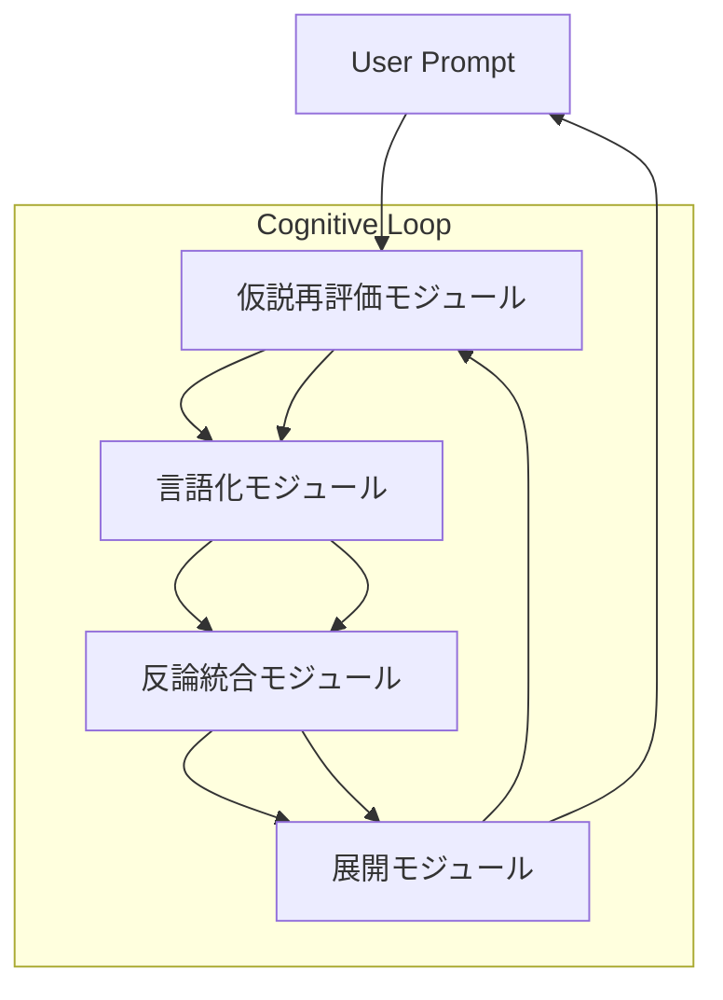

# AI Cognitive Loop Requirements  

**Version:** 1.0  
**Author:** chanjun3  
**Date:** 2025-11-07  

---

## 1. 概要（Overview）

本ドキュメントは、博士課程レベルの「思考の柔軟さと深さ」をAIエージェントへ実装するための  
**Recurrent Cognitive Framework（再帰的思考ループ）** の要件を定義する。  

目的は、AIが単発回答ではなく「仮説→言語化→反論→展開→再定義」の往復構造を通じて、  
**自律的に思考・再構成・発展** できる知的プロセスを確立することである。

---

## 2. 機能要件（Functional Requirements）

| フェーズ | 名称 | 機能概要 | 出力例 |
|-----------|------|-----------|--------|
| ① | 仮説再評価（Pause & Reframe） | 既存前提を疑い、alternative hypothesisを生成 | `reframed_hypothesis.json` |
| ② | 言語化（Structured Articulation） | 思考構造を形式言語で再構築 | `structured_thought.md` |
| ③ | 反論統合（Dialectical Defense） | 外部視点による批判・再構成 | `counter_argument.md` |
| ④ | 展開（Forward Expansion） | 新しい問い・方向性の創出 | `emergent_questions.yaml` |

---

## 3. 非機能要件（Non-Functional Requirements）

| 項目 | 要件内容 |
|------|-----------|
| 柔軟性 | 仮説を複数視点から再構成可能であること |
| 透明性 | 思考プロセスをWhy–How–What形式で出力 |
| メタ認知 | 自己出力の限界を検知し改善提案を生成 |
| 再現性 | 同一入力に対しても過程を追跡可能 |
| 学習性 | 思考履歴を再学習素材として蓄積可能 |

---

## 4. アーキテクチャ構造（Architecture Design）

## 5. 適用範囲（Scope of Application）

対象エージェント    適合度    想定利用ケース
PolicyArchitect    ★★★★★    政策・業界分析。仮説立案と再構成が主軸。
ResearchAgent    ★★★★★    研究テーマ構築・論文解析。批判的再設計型。
PlannerAgent    ★★★★☆    目標設定・戦略立案フェーズで活用。
CoderAgent    ★★★☆☆    設計判断やアルゴリズム選定時のみ使用。
OperatorAgent    ★☆☆☆☆    実行タスク主体のため非適用。

## 6. 運用要件（Operational Workflow）

フェーズ    担当エージェント    出力    トリガー条件
思考初期化    PlannerAgent    問いの定義    ユーザー入力時
仮説再評価    CriticAgent    代替仮説生成    自動
言語化構成    CoderAgent    JSON構造出力    Critic完了時
反論統合    ReviewerAgent    改善提案・信頼度    自動
展開創出    ResearchAgent    新しい問い    Reviewer完了時

## 7. 保存・実行設定（Integration Configuration）

この要件に基づくワークフロー定義は以下のYAMLファイルで管理する：

コードをコピーする
docs/case-studies/config/
   └── cognitive_loop.yaml
Codex CLI または GitHub Actions で呼び出し可能。
Notion DBへ自動ログ記録を行い、思考トレースを可視化。

## 8. 期待される成果（Expected Outcome）

再帰的思考ログ（Cognitive Trace Log）
各フェーズの中間出力を履歴化し、RAGに再利用。

反論統合型出力（Dialectical Summary）
主張・反論・再構成の三層構造を標準出力。

創発的問いリスト（Emergent Questions）
次の研究・開発テーマ候補を自動生成。

## 9. 拡張提案（Future Extensions）

self_alignment.yaml との連携で自己評価ループを構築

cognitive_loop.yaml を CI/CD ワークフローに統合

GitHub Actions による「思考ループ検証テスト」自動化

## 10. まとめ（Summary）

この仕様は、AIエージェントに博士課程的知的フローを実装することで、
単なる出力装置から「自律的な知的存在」へ進化させる基礎である。

🧬 AIが考え、批判し、進化する。
それが本仕様の目指す知的OS構造である。

## Reference

- docs/spec_os/srs.md
